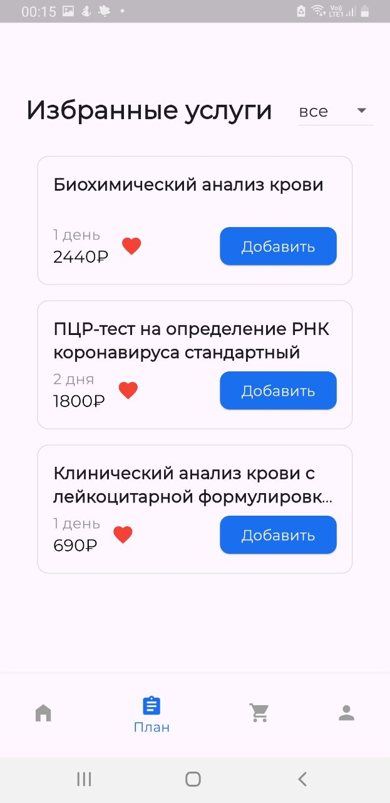
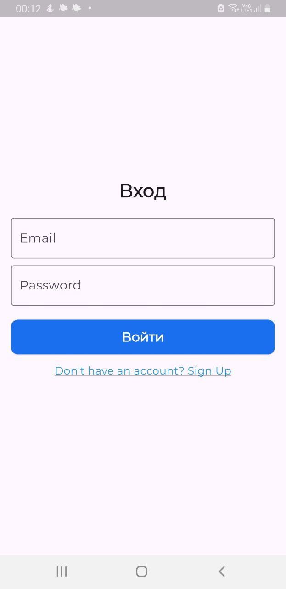
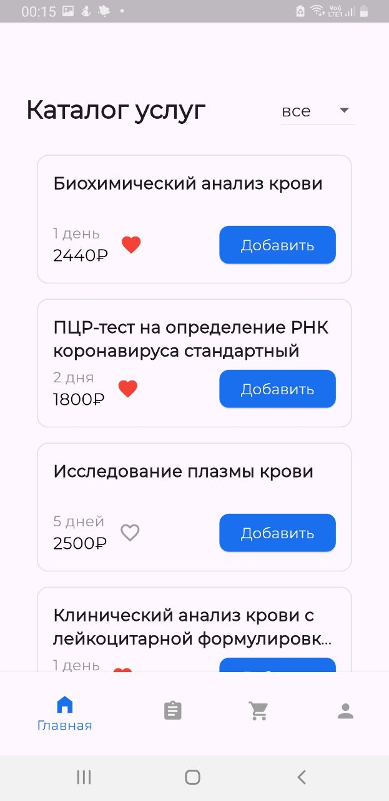
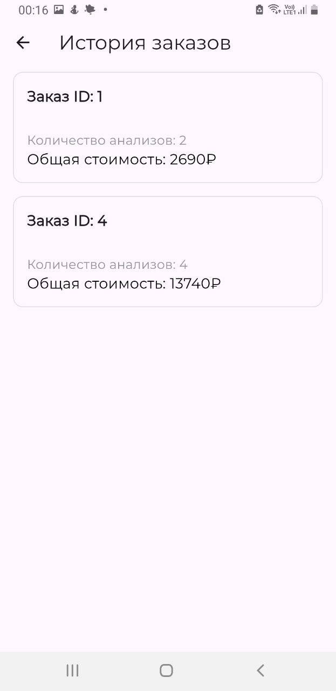
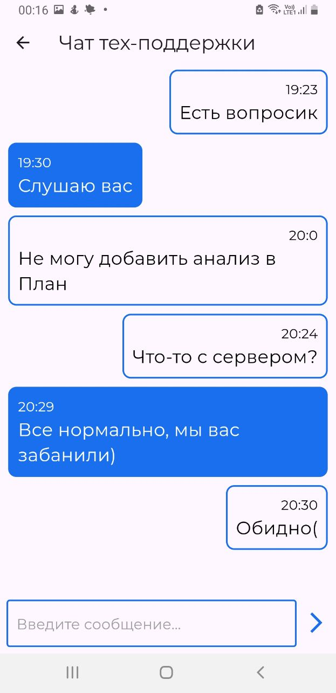
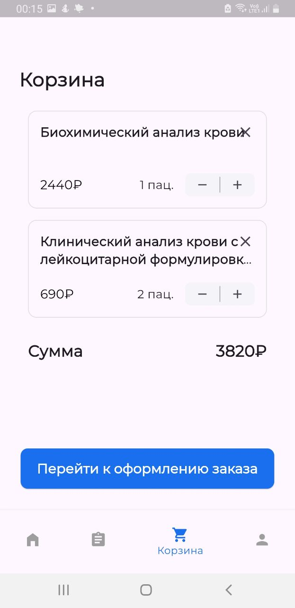
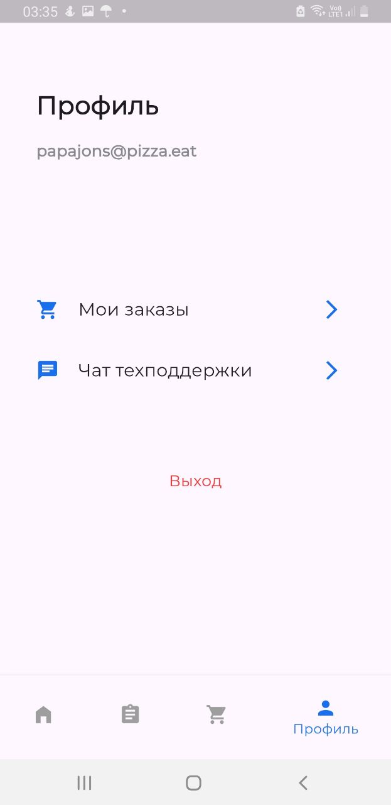

# ПКС ПРАКТИКА 16

# Захаров Илья Кириллович

## ЭФБО-03-22

-[App APK](app-release.apk)

## Краткое описание
Приложение для заказа анализов в нашей клинике

## Описание

Добро пожаловать в МедАнализы – приложение для быстрого заказа и планирования медицинских анализов. С МедАнализы вы можете легко и удобно заказывать необходимые анализы и следить за своим здоровьем.

Основные функции:

Регистрация и вход:

Легко зарегистрируйтесь или войдите в свой аккаунт.

Планирование анализов:

Добавляйте анализы в план по направлению врача или выбирайте общие анализы крови, мочи и кала.

Корзина заказов:

Собирайте анализы в корзину и отправляйте заказ на сервер.

История заказов:

Просматривайте историю своих заказов на странице пользователя.

Техническая поддержка:

Задавайте вопросы в чате техподдержки. Оператор поможет вам, если будет свободен.

Скачайте МедАнализы и убедитесь, что с вашим здоровьем все в порядке!

## Изображение приложения
------------

    

        
        
        
        
        
        
        
    

------------

## Пользовательское соглашение

Пользовательское соглашение мобильного приложения МедАнализы

1. Общие положения

1.1. Пользовательское соглашение (далее – «Соглашение») является публичной офертой и определяет условия использования материалов и сервисов, размещенных Администратором на платформе мобильного приложения: [Укажите URL-адрес] (далее – «Сайт») пользователями при помощи Сервиса.

1.2. Сервис – это программно-аппаратный комплекс, доступный при работе с мобильным приложением, позволяющий Пользователю использовать предусмотренный для него функционал. Сервис включает в себя интерфейс, программное обеспечение и иные элементы (инструменты, алгоритмы, способы), необходимые для надлежащего функционирования мобильного приложения.

1.3. Администратором является частное лицо Илья Кириллович Захаров, действующий как физическое лицо (далее – "Администратор").

1.4. Пользователь – любое физическое лицо, в том числе посетитель Сайта, принимающий условия Соглашения.

1.5. Соглашение является публичной офертой в соответствии со статьей 435 и пунктом 2 статьи 437 Гражданского кодекса Российской Федерации.

1.6. Соглашение, заключаемое путем акцепта настоящей оферты, не требует двустороннего подписания и действительно в электронном виде.

1.7. Для получения доступа к материалам Сайта Пользователю необходимо зарегистрироваться, путем заполнения регистрационной формы, содержащей следующие идентифицирующие Пользователя данные: Электронная почта.

1.8. Пройдя процедуру регистрации Пользователь считается принявшим условия Соглашения в полном объеме, без каких-либо исключений, оговорок, возражений.

1.9. При регистрации на Сайте Пользователь обязан предоставить Администратору необходимую, достоверную и актуальную информацию для формирования профиля, включая уникальные для каждого Пользователя логин (адрес электронной почты) и пароль доступа к Сайту.

1.10. Пользователь считается прошедшим регистрацию после предоставления необходимой, достоверной и актуальной информации для формирования профиля.

1.11. По завершении процесса регистрации Пользователь становится обладателем учетных данных Пользователя. Пользователь несет ответственность за безопасность учетных данных, а также за все, что будет сделано на Сайте под учетными данными Пользователя. Пользователь обязан немедленно уведомить Администратора о любом случае несанкционированного доступа к Сайту без согласия и ведома Пользователя и/или о любом нарушении безопасности учетной информации Пользователя.

1.12. В случае несогласия с Соглашением Пользователь обязан немедленно прекратить использование Сайта и покинуть его.

2. Обязательства пользователя

2.1. Использование материалов Сайта без согласия правообладателей не допускается.

2.2. При цитировании материалов Сайта, включая охраняемые авторские произведения, ссылка на Сайт обязательна.

2.3. Использование материалов Сайта без согласия правообладателей не допускается.

2.4. При цитировании материалов Сайта, включая охраняемые авторские произведения, ссылка на обязательна.

3. Ответственность администратора

3.1. Администратор не несет ответственности за посещение и использование Пользователем внешних ресурсов, ссылки на которые могут содержаться на Сайте.

3.2. Администратор не несет ответственности и не имеет прямых или косвенных обязательств перед Пользователем в связи с любыми возможными или возникшими потерями или убытками, связанными с любым содержанием Сайта, регистрацией авторских прав и сведениями о такой регистрации, товарами или услугами, доступными на или полученными через внешние сайты или ресурсы либо иные контакты Пользователя, в которые он вступил, используя размещенную на Сайте информацию или ссылки на внешние ресурсы.

3.3. Пользователь согласен с тем, что Администратор не несет какой-либо ответственности и не имеет каких-либо обязательств в связи с рекламой, которая может быть размещена на Сайте Администратором или третьими лицами, в том числе автоматизированными системами показа рекламы (объявлений), установленными на Сайте.

4. Заключительные положения

4.1. Все возможные споры, вытекающие из Соглашения или связанные с ним, подлежат разрешению в соответствии с действующим законодательством Российской Федерации.

4.2. Соглашение составлено в двух одинаковых экземплярах, имеющих равную юридическую силу – по одному для каждой Стороны.
